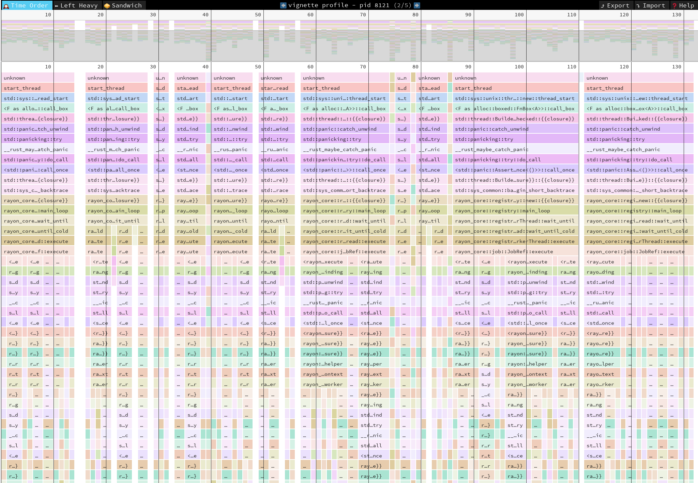

# Vignette

(Still needs to be published to crates.io. Also needs better documentation.)

Vignette is a sampling profiler as a library.

The primary use case is to ship it linked to your application in a release
configuration. While most sampling profilers require debugging symbols in the
binary being profiled, vignette does not have that requirement. It is
specifically designed to capture un-symbolicated profiles, which can be
resolved externally, usually on another machine.

This is very useful for desktop applications running on machines outside
developer control. The application can profile itself at certain points and
upload profiles to a telemetry server.

## Status

The Linux profiling process is implemented end-to-end. I know how to implement
it on Windows and Mac, but haven't gotten around to writing the backends yet.

## Sample workflow

### Integrate vignette

Link vignette into your application. For non-Rust applications, a C FFI
interface still needs to be written (contributions welcome!).

Then use the Profiler struct at points in your program where you'd like to
capture a profile. See examples/sample_once.rs for how to do this.

A larger example is this [fork of the Game of Life](https://github.com/nikhilm/rayon/commit/e7049b6bd9d2ba5091a510a41c3822e8b5839832) from Rayon.

### Build

During the build process, debugging information that are generated is saved on
servers, then stripped from the release binary.

Vignette currently only supports the use of the breakpad .sym format, but it
uses the symbolic crate and can conceivably support other input formats.

Use the src/bin/generate_symbols.rs binary that wraps `dump_syms` (from
Breakpad) on your binaries, or directly run `dump_syms` on all your libraries
to generate sym files.

### Release

Write the profile somewhere and upload it/request it from a user somehow.

### Resolve symbols

Using the breakpad symbols generated before, and the profile, resolve the
instruction pointers in the samples to function and file names.
src/bin/resolve.rs can do this.

This will generate a resolved json file. An example is
profiles/rayon-life.resolved.vignette.

### Viewing profiles

Right now vignette only outputs to a format understood by
[Speedscope](https://speedscope.app). The src/bin/speedscope.rs binary will
convert a resolved profile to a speedscope file. This can be loaded into the
website. An example is profiles/rayon-life.speed.

## License

Licensed under either of

 * Apache License, Version 2.0
   ([LICENSE-APACHE](LICENSE-APACHE) or http://www.apache.org/licenses/LICENSE-2.0)
 * MIT license
   ([LICENSE-MIT](LICENSE-MIT) or http://opensource.org/licenses/MIT)

at your option.

## Contribution

Contributions are welcome!

Any contribution intentionally submitted for inclusion in the work by you, as
defined in the Apache-2.0 license, shall be dual licensed as above, without any
additional terms or conditions.
